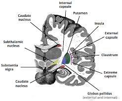

#Author: Nick

The basal ganglia are a collection of subcortical regions that are responsible for the production of complex motivated behavior. The circuits drive much of human motor behavior and are also heavily involved in theories about [[reinforcement_learning]] in people 

The structures include: 
- [[substantia_nigra]]
- caudate 
- putamen 
- globus pallidus
- parts of [[thalamus]]

[//begin]: # "Autogenerated link references for markdown compatibility"
[reinforcement_learning]: ../misc/reinforcement_learning "reinforcement_learning"
[substantia_nigra]: substantia_nigra "substantia_nigra"
[thalamus]: thalamus "thalamus"
[//end]: # "Autogenerated link references"