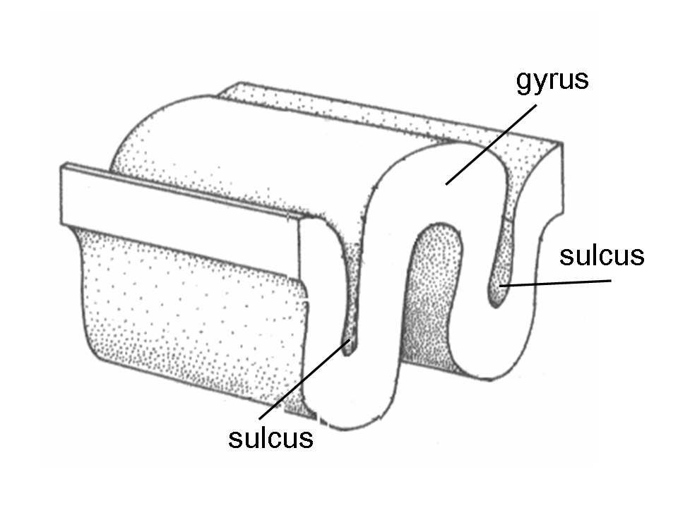

#Author: Nick

Gyrus/gyri (sing./plural) describe the outer folds/ridges of the cortical gray matter. Coming from the latin roughly meaning "circular" this is part of a pair of terms describing "hills vs valleys" of the brain's folds (Gyrus-hills ; [[sulci]]-valleys)

[//begin]: # "Autogenerated link references for markdown compatibility"
[sulci]: sulci "sulci"
[//end]: # "Autogenerated link references"