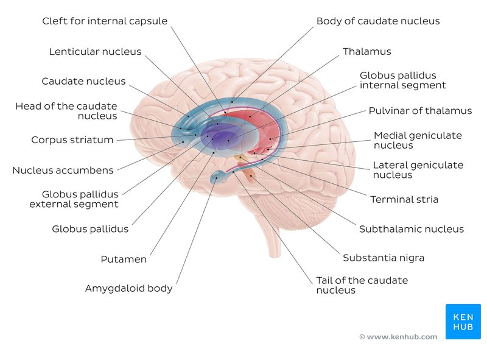

#Author: Nick

As the name implies the subcortex consists of everything "sub-to" the cortex, where "sub" means closer to the [[brainstem]]. The exact number depends on how one counts but the number of structures considered "subcortical" is on the order of a couple dozen. See the diagram below for a rough schematic of the major areas

In our research the two most frequently discussed subcortical structures are the [[hippocampus]] and the [[amygdala]]. Each is responsible for a relatively wide array of cognitive and emotional functions and subdivide into distinct subareas (subfields for hippocampus; [[nuclei]] for amygdala) but the oversimplified caricature is that the amygdala does fear+anger and the hippocampus does memory+novelty+navigation.

People sometimes talk about broader "neural circuits" or systems that frequently involve some subcortical structures. One such system that is discussed frequently in developmental and stress research is the Hypothalamic-pituitary-adrenal axis (or [[HPA_axis]]). Another, somewhat tenuous/controversial system that with a long history in [[affective_neuroscience]] is the 

[//begin]: # "Autogenerated link references for markdown compatibility"
[brainstem]: brainstem "brainstem"
[//end]: # "Autogenerated link references"