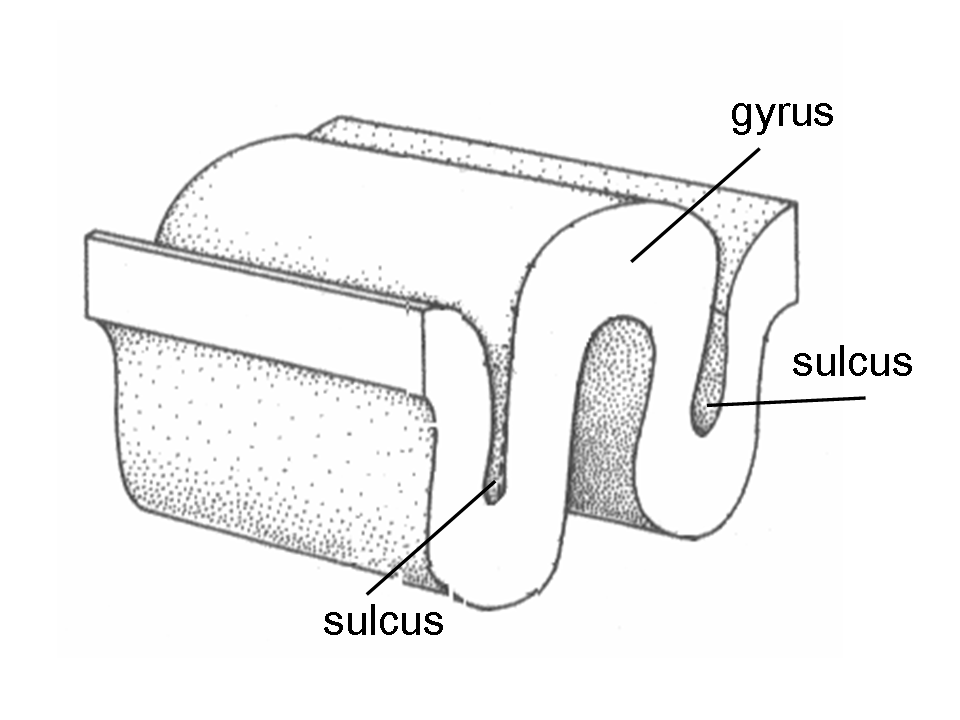

#Author: Nick

Sulcus/sulci (sing./plural) describe the inner folds/grooves of the cortical gray matter. Coming from the latin roughly meaning "furrow/wrinkle" this is part of a pair of terms describing "hills vs valleys" of the brain's folds ([[gyri]]-hills ; sulci-valleys)

[//begin]: # "Autogenerated link references for markdown compatibility"
[gyri]: gyri "gyri"
[//end]: # "Autogenerated link references"